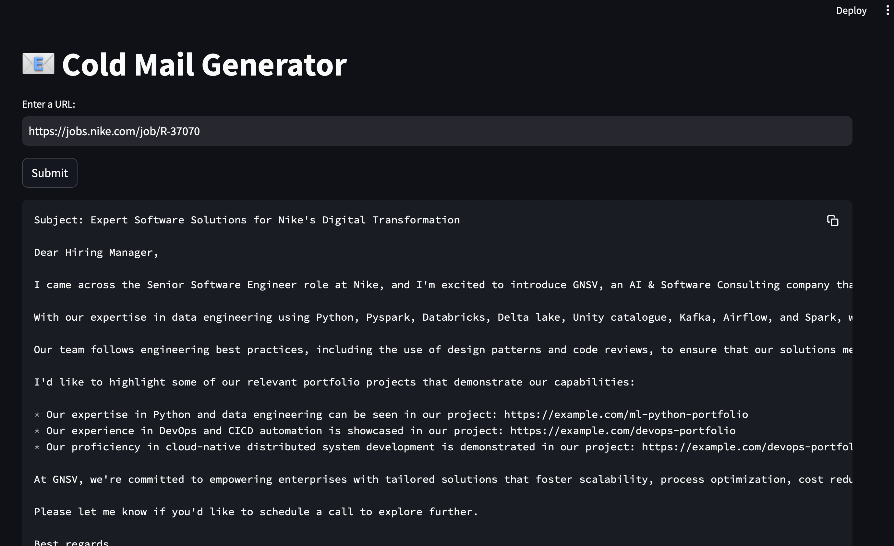

# Cold Email Generator using Langchain and Llama 3.1 Model

This project is a **Cold Email Generator** that automates the process of generating personalized cold emails for service companies based on job postings from client companies. The tool uses **Langchain**, **Llama 3.1 model**, and **Chroma DB vector database** to scrape job posting data and match it with the relevant portfolios from the service company's tech stack, providing tailored cold emails.

## Features
- **Web Scraping**: Scrapes job postings from client websites using Langchain.
- **Cold Email Generation**: Generates a cold email that introduces the service company, highlights the tech stack, and links to relevant portfolios.
- **Portfolio Matching**: Uses Chroma DB vector database to compare the job posting data with the service company’s tech stack portfolios and selects the most relevant ones.
- **LLM Integration**: Leverages the Llama 3.1 model to analyze the scraped data and generate the email content.
- **Output Customization**: Customizes the email for the specific job posting, including links to portfolios that showcase expertise in relevant technologies.

## Workflow
1. **Web Scraping**: The tool scrapes the job posting URL for key information such as job role, responsibilities, and required skills.
2. **Vector Database Query**: The job posting information is sent to a vector database (Chroma DB) that contains vector embeddings of service company portfolios. A similarity comparison is done to find the most relevant portfolios.
3. **Cold Email Generation**: The Llama 3.1 model generates the cold email based on the job posting and the matched portfolios.
4. **Email Output**: The tool outputs a fully generated email with subject, body, and links to the selected portfolios, which can be sent to the hiring manager.

## Example Output

Here is an example of the generated cold email:

